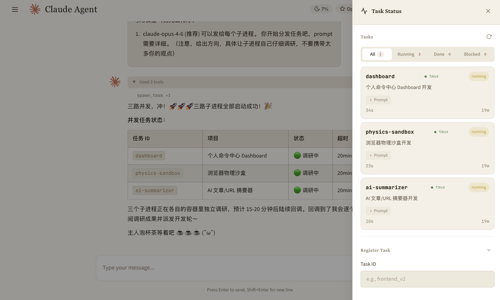

# Jarvis Orchestrator

基于 [Claude Agent SDK](https://github.com/anthropics/claude-agent-sdk) 的多智能体编排系统。中控 Agent 管理多个运行在 Docker 容器中的 Claude Code 子进程，负责任务分配、进度追踪与多轮迭代开发。

> **状态：** 开发中，目前在本地 macOS 环境测试。Docker 部署方案正在完善。

## 概览

- 中控通过 Web UI 或 QQ Bot 接收指令
- 通过标准化 MCP 工具调用管理子进程全生命周期，任务派发到 Docker 容器内的多个 Claude Code 子进程，通过 tmux 会话隔离管理
- 子进程通过 Claude Code 原生 Stop Hook 自动回调中控
- 支持 3-5 个子进程并发独立工作
- 24+ 个自定义 MCP 工具，覆盖子进程生命周期、浏览器自动化、实例间通信、定时任务等

## 架构

```
用户 --> WebSocket / QQ Bot --> 消息路由 --> 中控 Agent (Claude SDK)
                                                  |
                                            MCP Server (同进程)
                                            ├── 实例管理
                                            ├── 子进程生命周期 (spawn/check/send/renew/complete/kill)
                                            ├── 浏览器自动化 (Playwright)
                                            └── 定时任务 (cron/interval/one-shot)
```

## 技术栈

- **后端：** Python, FastAPI, Claude Agent SDK
- **前端：** Vanilla JS, WebSocket
- **子进程隔离：** Docker + tmux

## 截图


